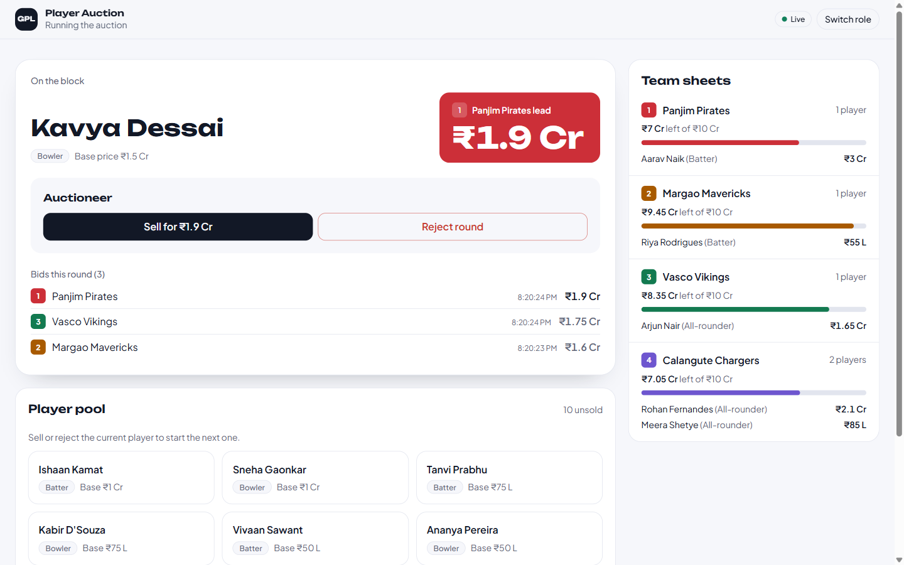
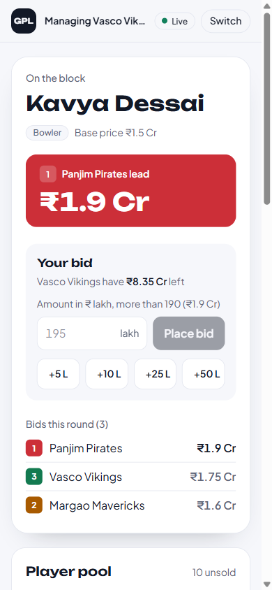
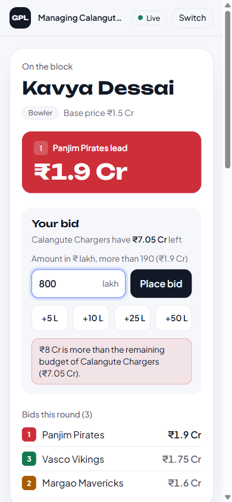
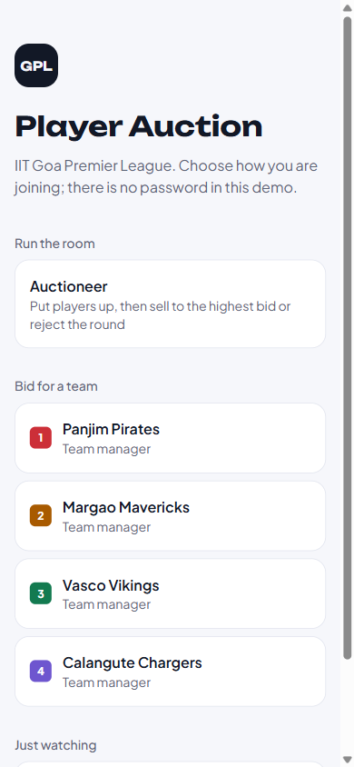
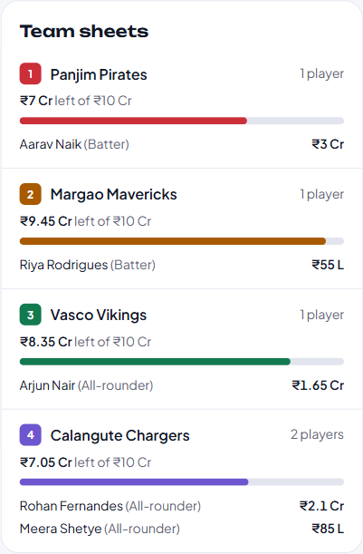

# GPL Auction

Player auction for the IIT Goa Premier League. The auctioneer puts one player up at a time, four team managers bid, and every open screen updates as bids come in. Accepting a bid moves the player to that team and takes the price off its budget. Data is stored in SQLite, so rosters and budgets survive a restart.

FastAPI + SQLite backend, React + Vite + Tailwind frontend, live updates over Server-Sent Events.



## Run

Needs Python 3.11+ and Node 20.19+.

```bash
# 1. build the frontend
cd frontend
npm ci
npm run build
cd ..

# 2. start the backend (it also serves the built frontend)
cd backend
python -m venv .venv
.venv\Scripts\activate          # macOS/Linux: source .venv/bin/activate
pip install -r requirements.txt
uvicorn app.main:app --timeout-graceful-shutdown 1
```

Open **http://127.0.0.1:8000**. API docs are at **http://127.0.0.1:8000/docs**.

The database (`backend/gpl.db`) is created and seeded on first start. To start over, stop the server and delete that file.

**Development:** run `uvicorn app.main:app --reload --timeout-graceful-shutdown 1` in `backend` and `npm run dev` in `frontend`, then open http://localhost:5173 (Vite proxies `/api` to the backend).

### Roles

The first screen is a role picker (no login, as the brief allows): **Auctioneer**, one of the four **team managers**, or **Spectator**. The role is kept per browser tab, so you can run the auctioneer and the managers side by side in separate tabs.

## Tests

```bash
cd backend
pip install -r requirements-dev.txt
pytest
```

34 tests run through the real HTTP API against a temporary SQLite database. They cover every bid rule, the budget check, accept moving the player onto the roster at the bid price, reject, data surviving a restart, and four simultaneous equal bids of which only one is stored.

## Budgets and bid rules

- Amounts are whole **lakh** (`150` = ₹1.5 Cr).
- Four teams, each with a budget of **₹10 Cr (1000 lakh)**: Panjim Pirates, Margao Mavericks, Vasco Vikings, Calangute Chargers.
- 16 preloaded players with base prices from ₹20 L to ₹2 Cr ([`backend/app/seed.py`](backend/app/seed.py)).

A bid is checked in this order, inside one database transaction:

1. Only a team manager can bid (`403 FORBIDDEN`).
2. A player must be up for auction (`409 NO_ACTIVE_AUCTION`).
3. The team must exist (`404 TEAM_NOT_FOUND`).
4. A team that already holds the highest bid can't bid again until it is outbid (`409 ALREADY_HIGHEST_BIDDER`).
5. The amount must be more than the base price (`400 BID_NOT_ABOVE_BASE`).
6. The amount must be more than the current highest bid (`400 BID_NOT_ABOVE_HIGHEST`).
7. The amount can't exceed the team's remaining budget (`400 OVER_BUDGET`). Bidding exactly the remaining budget is allowed.

Refused bids are not stored. The auctioneer:

- runs one auction at a time (`409 AUCTION_IN_PROGRESS` otherwise);
- accepts the highest bid by its id. If a higher bid came in meanwhile, the accept is refused (`409 BID_NOT_HIGHEST`). Accepting marks the player sold, adds them to the team and subtracts the price from its remaining budget;
- or rejects the round: the player goes back to the pool unsold and that round's bids no longer count.

## API

- Base path: `/api`. Requests and responses are JSON. **All amounts are whole ₹ lakh.**
- Identity header: `X-Role: auctioneer | manager | viewer`. A missing header means viewer.
- Every error has the same shape, with a stable `code` for programs and a readable `message` for people:

```json
{ "error": { "code": "OVER_BUDGET", "message": "₹20 Cr is more than the remaining budget of Vasco Vikings (₹10 Cr)." } }
```

| Method | Path | Who | Purpose |
|---|---|---|---|
| GET | [`/api/players`](#get-apiplayers) | anyone | List all players |
| GET | [`/api/teams`](#get-apiteams) | anyone | Team rosters and budgets |
| GET | [`/api/auction`](#get-apiauction) | anyone | Player on the block and this round's bids |
| POST | [`/api/auction/start`](#post-apiauctionstart) | auctioneer | Put a player up for auction |
| POST | [`/api/auction/bids`](#post-apiauctionbids) | manager | Place a bid |
| POST | [`/api/auction/accept`](#post-apiauctionaccept) | auctioneer | Sell to the highest bid |
| POST | [`/api/auction/reject`](#post-apiauctionreject) | auctioneer | Reject the round |
| GET | [`/api/events`](#live-updates-server-sent-events) | anyone | Live updates (SSE) |

Interactive docs: `/docs`.

### GET /api/players

All players ordered by id. The UI's "Player pool" shows those with `status: "available"`.

- **Request body:** none
- **Success:** `200 OK`, `Player[]`

```json
[{ "id": 1, "name": "Aarav Naik", "skill": "batting", "base_price": 200, "status": "available", "sold_price": null, "team_id": null }]
```

- **Errors:** none specific (only `500` on a server fault)

### GET /api/teams

Every team with its budget and the players it has bought.

- **Request body:** none
- **Success:** `200 OK`, `Team[]`

```json
[{ "id": 4, "name": "Calangute Chargers", "total_budget": 1000, "remaining_budget": 800,
   "players": [{ "id": 3, "name": "Rohan Fernandes", "skill": "both", "base_price": 150, "status": "sold", "sold_price": 200, "team_id": 4 }] }]
```

- **Errors:** none specific

### GET /api/auction

The player currently on the block and this round's bids. `bids[0]` is the highest.

- **Request body:** none
- **Success:** `200 OK`, `Auction`

```json
{ "player": { "id": 2, "name": "Kavya Dessai", "skill": "bowling", "base_price": 150, "status": "in_auction", "sold_price": null, "team_id": null },
  "bids": [
    { "id": 6, "player_id": 2, "team_id": 2, "team_name": "Margao Mavericks", "amount": 175, "created_at": "2026-10-06T22:43:58.420Z" },
    { "id": 5, "player_id": 2, "team_id": 1, "team_name": "Panjim Pirates", "amount": 160, "created_at": "2026-10-06T22:43:58.407Z" } ] }
```

When nothing is on the block: `{ "player": null, "bids": [] }`.

- **Errors:** none specific

### POST /api/auction/start

Put an available player up for auction.

- **Header:** `X-Role: auctioneer`
- **Request body:** `{ "player_id": 2 }`
- **Success:** `200 OK`, `Auction` (the player with `status: "in_auction"` and `bids: []`)

| Status | Code | When |
|---|---|---|
| 403 | `FORBIDDEN` | `X-Role` is not `auctioneer` |
| 422 | `VALIDATION_ERROR` | `player_id` missing or not an integer |
| 409 | `AUCTION_IN_PROGRESS` | Another player is already on the block |
| 404 | `PLAYER_NOT_FOUND` | No player with that id |
| 409 | `PLAYER_NOT_AVAILABLE` | The player has already been sold |

### POST /api/auction/bids

Place a bid for a team on the player currently on the block.

- **Header:** `X-Role: manager`
- **Request body:** `{ "team_id": 3, "amount": 185 }`. `amount` is in ₹ lakh and must be a positive integer.
- **Success:** `201 Created`, the stored `Bid` (now the highest)

```json
{ "id": 7, "player_id": 2, "team_id": 3, "team_name": "Vasco Vikings", "amount": 185, "created_at": "2026-10-06T22:50:12.031Z" }
```

| Status | Code | When |
|---|---|---|
| 403 | `FORBIDDEN` | `X-Role` is not `manager` |
| 422 | `VALIDATION_ERROR` | `team_id` or `amount` missing, not an integer, or `amount` ≤ 0 |
| 409 | `NO_ACTIVE_AUCTION` | No player is on the block |
| 404 | `TEAM_NOT_FOUND` | No team with that id |
| 409 | `ALREADY_HIGHEST_BIDDER` | This team already holds the highest bid |
| 400 | `BID_NOT_ABOVE_BASE` | `amount` ≤ the player's base price |
| 400 | `BID_NOT_ABOVE_HIGHEST` | `amount` ≤ the current highest bid |
| 400 | `OVER_BUDGET` | `amount` > the team's remaining budget |

### POST /api/auction/accept

Sell the player on the block to the highest bid.

- **Header:** `X-Role: auctioneer`
- **Request body:** `{ "bid_id": 7 }`. This must be the current highest bid.
- **Success:** `200 OK`, the sold `Player`

```json
{ "id": 2, "name": "Kavya Dessai", "skill": "bowling", "base_price": 150, "status": "sold", "sold_price": 185, "team_id": 3 }
```

Side effects: the team's `remaining_budget` drops by `sold_price`, the player appears in that team's `players`, and the block is empty again.

| Status | Code | When |
|---|---|---|
| 403 | `FORBIDDEN` | `X-Role` is not `auctioneer` |
| 422 | `VALIDATION_ERROR` | `bid_id` missing or not an integer |
| 409 | `NO_ACTIVE_AUCTION` | No player is on the block |
| 409 | `NO_BIDS` | Nobody has bid yet (reject the round instead) |
| 409 | `BID_NOT_HIGHEST` | A higher bid arrived since the auctioneer looked; nothing is sold |

### POST /api/auction/reject

End the round without a sale. The player goes back to the pool.

- **Header:** `X-Role: auctioneer`
- **Request body:** none
- **Success:** `200 OK`, the `Player` with `status: "available"`, `team_id: null`, `sold_price: null`

| Status | Code | When |
|---|---|---|
| 403 | `FORBIDDEN` | `X-Role` is not `auctioneer` |
| 409 | `NO_ACTIVE_AUCTION` | No player is on the block |

---

## Live updates (Server-Sent Events)

`GET /api/events` returns a `text/event-stream`. The frontend opens it with `EventSource`, which reconnects by itself.

| Event | When | `data` |
|---|---|---|
| `state` | On connect, then after every successful start, bid, accept or reject | `{"players": Player[], "teams": Team[], "auction": Auction}` |
| `ping` | After 15 s with no `state` event | `1` |

```
event: state
data: {"players": [...], "teams": [...], "auction": {"player": {...}, "bids": [...]}}

event: ping
data: 1
```

If the browser hears nothing for 40 s it reopens the stream.

## Database schema

SQLite, one file at `backend/gpl.db` (`GPL_DB_PATH` overrides it). Foreign keys are enforced. Source: [`backend/app/schema.sql`](backend/app/schema.sql).

```sql
-- money is stored in lakh (integers)

CREATE TABLE IF NOT EXISTS teams (
    id               INTEGER PRIMARY KEY,
    name             TEXT    NOT NULL UNIQUE,
    total_budget     INTEGER NOT NULL CHECK (total_budget > 0),
    remaining_budget INTEGER NOT NULL,
    CHECK (remaining_budget BETWEEN 0 AND total_budget)
);

CREATE TABLE IF NOT EXISTS players (
    id         INTEGER PRIMARY KEY,
    name       TEXT    NOT NULL,
    skill      TEXT    NOT NULL CHECK (skill IN ('batting', 'bowling', 'both')),
    base_price INTEGER NOT NULL CHECK (base_price > 0),
    status     TEXT    NOT NULL DEFAULT 'available'
                       CHECK (status IN ('available', 'in_auction', 'sold')),
    sold_price INTEGER CHECK (sold_price > 0),
    team_id    INTEGER REFERENCES teams (id),
    -- sold <=> has a team and a price
    CHECK (
        (status = 'sold'  AND team_id IS NOT NULL AND sold_price IS NOT NULL) OR
        (status <> 'sold' AND team_id IS NULL     AND sold_price IS NULL)
    )
);

-- one auction at a time
CREATE UNIQUE INDEX IF NOT EXISTS one_player_in_auction
    ON players (status) WHERE status = 'in_auction';

CREATE TABLE IF NOT EXISTS bids (
    id         INTEGER PRIMARY KEY,
    player_id  INTEGER NOT NULL REFERENCES players (id),
    team_id    INTEGER NOT NULL REFERENCES teams (id),
    amount     INTEGER NOT NULL CHECK (amount > 0),
    created_at TEXT    NOT NULL DEFAULT (strftime('%Y-%m-%dT%H:%M:%fZ', 'now')),
    voided     INTEGER NOT NULL DEFAULT 0 CHECK (voided IN (0, 1))  -- 1 = round was rejected
);
```

### teams

| Column | Type | Key | Constraints / notes |
|---|---|---|---|
| `id` | INTEGER | **PK** | |
| `name` | TEXT | | NOT NULL, UNIQUE |
| `total_budget` | INTEGER | | NOT NULL, > 0 (₹ lakh) |
| `remaining_budget` | INTEGER | | NOT NULL, between 0 and `total_budget` |

### players

| Column | Type | Key | Constraints / notes |
|---|---|---|---|
| `id` | INTEGER | **PK** | |
| `name` | TEXT | | NOT NULL |
| `skill` | TEXT | | NOT NULL, one of `batting`, `bowling`, `both` |
| `base_price` | INTEGER | | NOT NULL, > 0 (₹ lakh) |
| `status` | TEXT | | NOT NULL, default `available`; one of `available`, `in_auction`, `sold`; **at most one row `in_auction`** (partial unique index) |
| `sold_price` | INTEGER | | NULL until sold, then > 0 |
| `team_id` | INTEGER | **FK → teams.id** | NULL until sold |
| *(row check)* | | | `sold` ⇔ `team_id` and `sold_price` are both set |

### bids

| Column | Type | Key | Constraints / notes |
|---|---|---|---|
| `id` | INTEGER | **PK** | |
| `player_id` | INTEGER | **FK → players.id** | NOT NULL |
| `team_id` | INTEGER | **FK → teams.id** | NOT NULL |
| `amount` | INTEGER | | NOT NULL, > 0 (₹ lakh) |
| `created_at` | TEXT | | NOT NULL, UTC ISO 8601 timestamp (the brief's "time"), set by the database |
| `voided` | INTEGER | | NOT NULL, 0 or 1. `1` marks bids from a rejected round, so they never count again |

Rules that need more than one table (bid above the current highest, within the remaining budget) are checked in [`backend/app/auction.py`](backend/app/auction.py) inside a write transaction.

## Screenshots

| Manager on a phone | Bid over budget | Role picker |
|---|---|---|
|  |  |  |

Team rosters:


